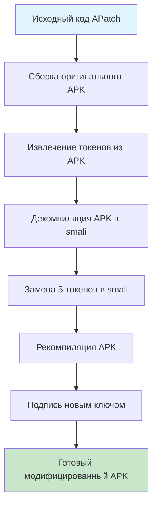

# 🎯 Классический метод с токенами APatch

## 📋 Обзор

**Классический метод с токенами** - это способ модификации APatch, который **НЕ изменяет исходный код** репозитория, сохраняя его идентичным оригиналу.

### ✅ Преимущества классического метода:

- **🔒 Чистый репозиторий** - исходный код остается неизменным
- **🎯 Точечная замена** - изменяются только необходимые токены
- **🔄 Обратимость** - можно легко вернуться к оригиналу
- **🛡️ Безопасность** - нет модификации исходного кода

---

## 🔄 Как это работает



### 🎯 Заменяемые токены:

1. **`APATCH_REAL_SIGNATURE`** - Реальная подпись сертификата
2. **`APATCH_CODE_SIGNATURE`** - Подпись кода  
3. **`APATCH_PACKAGE_NAME`** - Имя пакета (например: `me.bmax.apatch`)
4. **`APATCH_APP_CLASS`** - Класс приложения (например: `APApplication`)
5. **`APATCH_SIGNATURE_METHOD`** - Метод проверки подписи (например: `verifySignature`)

---

## 🚀 Быстрый старт

### 1. Настройка secrets (автоматически)

```bash
# Установите PyNaCl для шифрования
pip install PyNaCl

# Установите GitHub токен
export GITHUB_TOKEN=your_github_token

# Запустите автоматическую настройку
python3 setup_classic_secrets.py
```

### 2. Запуск workflow

1. Перейдите на: https://github.com/AngelOfLlife/APatch/actions/workflows/classic_token_apatch_build.yml
2. Нажмите **"Run workflow"**
3. Выберите источник APK:
   - `build` - собрать из исходного кода
   - `download_release` - скачать последний релиз
4. Нажмите **"Run workflow"**

---

## 🔐 Необходимые GitHub Secrets

### 📝 APatch токены (5 секретов):
```
APATCH_REAL_SIGNATURE    # Реальная подпись: sypblYtJUCDSbk/u67zSBUyhRj+t7n6Tm6EPuEUnku4=
APATCH_CODE_SIGNATURE    # Подпись кода: 1x2twMoHvfWUODv7KkRRNKBzOfEqJwRKGzJpgaz18xk=
APATCH_PACKAGE_NAME      # Имя пакета: me.bmax.apatch
APATCH_APP_CLASS         # Класс приложения: APApplication
APATCH_SIGNATURE_METHOD  # Метод проверки: verifySignature
```

### 🔑 Signing secrets (4 секрета):
```
SIGNING_KEY              # Base64 keystore для подписи
KEY_STORE_PASSWORD       # Пароль keystore
KEY_PASSWORD             # Пароль ключа
ALIAS                    # Алиас ключа
```

---

## 🛠️ Ручная настройка secrets

### Создание keystore:
```bash
keytool -genkeypair \
  -alias apatch-classic \
  -keyalg RSA \
  -keysize 2048 \
  -validity 10000 \
  -keystore apatch.p12 \
  -storetype PKCS12 \
  -dname "CN=APatch, OU=Android, O=APatch, C=RU"
```

### Кодирование keystore в base64:
```bash
base64 apatch.p12 > keystore_base64.txt
```

### Добавление в GitHub:
1. Перейдите в Settings → Secrets and variables → Actions
2. Нажмите "New repository secret"
3. Добавьте каждый secret по имени

---

## 🔍 Извлечение токенов из APK

Workflow автоматически извлекает токены из APK, но можно также сделать это вручную:

```python
# Используйте extract_apatch_tokens.py (создается автоматически в workflow)
python3 extract_apatch_tokens.py original-apatch.apk
```

---

## 📱 Результат

После успешного выполнения workflow вы получите:

- **`apatch-classic-signed.apk`** - модифицированный APK
- **`apatch_tokens.env`** - извлеченные токены
- **Подробный отчет** о процессе замены

### 📊 Информация о APK:
- Размер файла
- SHA256 хэш
- Информация о подписи
- Список замененных токенов

---

## 🔄 Сравнение с Enhanced методом

| Критерий | 🎯 Classic | 🚀 Enhanced |
|----------|------------|-------------|
| **Изменение исходного кода** | ❌ НЕТ | ✅ ДА |
| **Чистота репозитория** | ✅ Чистый | ❌ Изменен |
| **Сложность настройки** | 🟡 Средняя | 🟢 Простая |
| **Количество secrets** | 9 секретов | 4 секрета |
| **Точность замены** | 🎯 Точечная | 🌊 Универсальная |
| **Обратимость** | ✅ Полная | ⚠️ Частичная |

---

## ❓ FAQ

### Q: Зачем нужны токены APatch?
**A:** Токены позволяют заменить оригинальные подписи и идентификаторы APatch на ваши собственные, обходя проверки подписи.

### Q: Можно ли использовать токены из другого APK?
**A:** Да, workflow автоматически извлекает токены из любого APK APatch.

### Q: Что если токены неправильные?
**A:** APK может не работать или выдавать ошибки подписи. Используйте правильные токены из оригинального APK.

### Q: Нужно ли каждый раз менять токены?
**A:** Нет, токены APatch обычно стабильны между версиями.

---

## 🔧 Troubleshooting

### Ошибка декомпиляции APK:
```bash
# Обновите apktool до последней версии
wget https://github.com/iBotPeaches/Apktool/releases/latest/download/apktool_*.jar
```

### Ошибка подписи APK:
```bash
# Проверьте правильность keystore
keytool -list -v -keystore keystore.p12
```

### Ошибка GitHub secrets:
```bash
# Проверьте права GitHub токена
curl -H "Authorization: token $GITHUB_TOKEN" \
  https://api.github.com/repos/AngelOfLlife/APatch/actions/secrets/public-key
```

---

## 📚 Дополнительные ресурсы

- [APatch оригинальный репозиторий](https://github.com/bmax121/APatch)
- [Документация apktool](https://ibotpeaches.github.io/Apktool/)
- [GitHub Actions secrets](https://docs.github.com/en/actions/security-guides/encrypted-secrets)

---

## 🎉 Поддержка

Если у вас возникли вопросы или проблемы:

1. Проверьте [Issues](https://github.com/AngelOfLlife/APatch/issues)
2. Создайте новый Issue с подробным описанием
3. Используйте тег `classic-tokens` для быстрого поиска

---

**🎯 Классический метод - идеальное решение для сохранения чистоты репозитория!** 🛡️